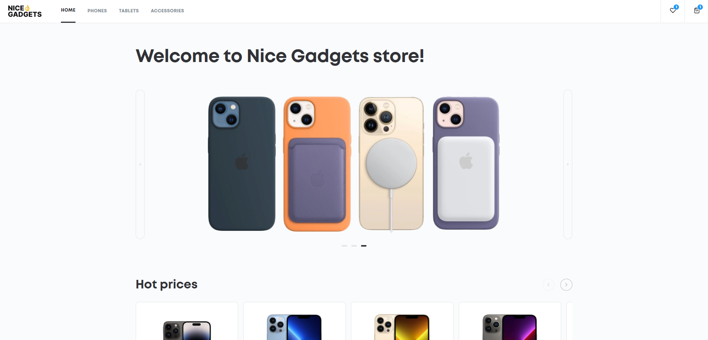

# Nice Gadgets Store (React + TypeScript)



## 🔗 Live Demo
### [👉 Click here to view the deployed application](https://kanezoor.github.io/nice-gadgets-store/)

## 📝 Description
A modern, responsive e-commerce web application designed for browsing and purchasing tech gadgets (Phones, Tablets, Accessories).

This project was built to master **Modern React Patterns** and **TypeScript**. It moves beyond simple static pages to handle complex application state, such as managing a shopping cart, filtering product data in real-time, and ensuring type safety across components.

## 🛠 Technologies Used
* **Framework:** React.js 18 (Functional Components & Hooks)
* **Language:** TypeScript
* **Styling:** Bulma (CSS Framework) & SCSS
* **Routing:** React Router v6
* **Build Tool:** Vite (via Mate Scripts)
* **State Management:** React Context API / useState
* **Animations:** React Transition Group
* **Icons:** FontAwesome

## ✨ Key Features
* **🛒 Dynamic Shopping Cart:** Users can add/remove items, and the cart total calculates automatically.
* **🔍 Product Filtering:** Real-time filtering of gadgets by category (e.g., "Phones", "Accessories") and price range.
* **📱 Responsive Grid:** A mobile-first product grid built with the Bulma framework.
* **⚡ Client-Side Routing:** Seamless navigation between pages (Home, Cart, Product Details) without page reloads.
* **Strict Typing:** All components and data models (e.g., `Product`, `CartItem`) are strictly typed with TypeScript interfaces to prevent runtime errors.

## 🚀 How to Run Locally
This project requires Node.js (v20 recommended) to be installed.

1. Clone the repository:
   ```bash
   git clone [https://github.com/Kanezoor/nice-gadgets-store.git](https://github.com/Kanezoor/nice-gadgets-store.git)
2. Navigate to the project folder:

Bash

cd nice-gadgets-store
Install dependencies:

Bash

npm install
Start the development server:

Bash

npm start
(The app will automatically open at http://localhost:3000)

🧠 What I Learned
TypeScript Integration: I learned how to define Interfaces for my data models (e.g., interface Product { id: number; price: number; ... }) and explicit types for Component Props, which significantly reduced bugs during development.

Using CSS Frameworks: I integrated Bulma to speed up UI development while using SCSS and Classnames for custom styling overrides.

Complex State Logic: I gained experience syncing the shopping cart state between the Product List component and the Navbar component using Context.

Routing: Implemented react-router-dom to handle dynamic URLs (e.g., /product/:id) and navigation history.

<div align="center"> Created by <a href="https://github.com/Kanezoor">Vladyslav Kostiuk</a> </div>
